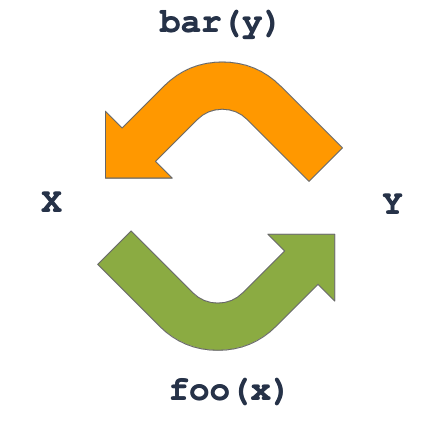

# Troll of Fame - OCaml

This project aims to pratice property based testing.

## More about OCaml

### Naming

Mandatory :

- Types and let bindings names **have to** start with an lower character
- Modules and Module types names **have to** start with an upper character

Conventions :

- Types : lower_case.
- Type variables : 'lower_case
- Values and Functions : lower_case
- Variant type constructors : Upper_Case
- Record Fields : lower_case
- Modules : UpperCase
- Module Types: ALLCAPS

Modules are a great tool for namespaces. By convenvention, the main type inside `MyModule` should be named `t` ✅ (neither `my_module` ❌ nor `foo` ❌)

For `Stdlib` types we have casting functions like `string_of_int`, `int_of_string`, `bool_of_int`, `int_of_bool`.

For `MyModule` main type `t`, we prefer to use `MyModule.to_string` ✅ and `MyModule.of_string` ✅ instead of `MyModule.t_of_string` ❌ and `MyModule.string_of_t` ❌.

### Preprocessor

> This section contains an excerpt of [OCaml Real World](https://dev.realworldocaml.org/)

One powerful feature in OCaml is a facility to extend the standard language via extension points. These represent placeholders in the OCaml syntax tree and are ignored by the standard compiler tooling, beyond being delimited and stored in the abstract syntax tree alongside the normal parsed source code. They are intended to be expanded by external tools that select extension nodes that can interpret them.

#### Extension Attributes

The basic form of an attribute is the [@ ... ] syntax. The number of @ symbols defines which part of the syntax tree the attribute is bound to:

- a single [@ binds to expressions and individual type definitions.
- a double [@@ binds to blocks of code, such as module definitions, type declarations or class fields.
- a triple [@@@ appears as a standalone entry in a module implementation or signature, and are not tied to any specific source code node.

### PPX

OCaml provides a syntactic extension facility known as “PreProcessor eXtensions”, or PPXs.

_You can think at ppx as C preprocessor or Java annotation (but at compile time)_

Understanding PPX behind the scene is not mandatory for this kata. But if you want to know more about ppx you should read: [An introduction to OCaml PPX ecosystem](https://tarides.com/blog/2019-05-09-an-introduction-to-ocaml-ppx-ecosystem)

#### ppx deriving

Deriving is a library simplifying type-driven code generation.

For this kata you should only know about [ppx-deriving](https://github.com/ocaml-ppx/ppx_deriving) used by the **troll Gnonpom** to code the **Troll of Fame** application, so you should read the manual for used plugins:

- eq and ord : https://github.com/ocaml-ppx/ppx_deriving#plugins-eq-and-ord
- enum : https://github.com/ocaml-ppx/ppx_deriving#plugin-enum
- show : https://github.com/ocaml-ppx/ppx_deriving#plugin-show

## Getting started

Setups of the last kata are working: [need to read again about setup](https://github.com/miage-lille/tennis-kata/blob/master/doc/00-setup.md)

Clone the project, then you can:
- Install dependencies : `esy install`
- Build your project : `esy`
- Run compiled executable : `esy start`
- Run tests : `esy test`

## Once upon a time ⋯

The King of the Trolls Gnonpom coded the **Troll of Fame** : a wonderfull application that would help Trolls to learn numbers when they are hunting.
Gnonpom was a hard skilled Test Driven Developer king who just released **ToF** when all tests passed Green.

Sadly he was shooted by a disgusting Elf.

Here come a new King, Hurrah for the great Troll Aklass!

This time it's decided, the elf hunting contest is launched!

At the end of each battle, the trolls want to compare the number and attributes of the slain elves. And with **ToF** it should be easy ⋯ Should.

## Exercices

This Kata will make you discover Property Based Testing. Along the kata, you will learn some kind of properties you may extract and test in a program. This may lead to catch new bugs in the program. Lucky you, that is our goal! Whenever you find a new bug, you have to fix it before going to the next step.

### Work with legacy code

You inherit an application that seems to work fine. Run `esy test` (•̀ᴗ•́)و ̑̑

Read [./test/elf_test.ml](./test/elf_test.ml) and [./test/troll_test.ml](./test/troll_test.ml) as a first specification of the software.

Now uncomment the content of [./test/elf_prop.ml](./test/elf_prop.ml) 

> This means to uncomment `elf_invariance_2` and add it to the list of tests to run `troll_prop_set`

and run tests again `esy test` ⋯ Ooops seems that our unit tests were not so complete. (╥﹏╥)

We will try to improve the quality of _Troll of Frame_ thanks to Property Based Testing.

### Property testing

Property Based Testing (a.k.a. PBT) is about generating tests instead of manually writing them. Unlike unit tests where you know what goes in and what comes out (a.k.a. oracle tests), you assess properties that should always be true. The PBT library checks for arbitrary inputs that the property is true.

In OCaml, we use `qcheck` library to write Property Based tests with `alcotest` to run them.

#### Step 1 - Configuration and Invariance


_No matter the year, the 31st of December is a New Year's Eve_

- For a simpler start, we already configured the build dependencies and created generators for `Elf` and `Troll` in the test lib. The module `Generator.Fantasy` provides all the generators you need. A generator is a value of type `'a QCheck2.Gen.t` and is used to generate values of type `'a` by the test runner:

  - `elf_gen`: generate value of type `Elf.t`
  - `elf_high_gen`: generate value of type `Elf.t` with `race = Race.HighElf`
  - `troll_gen`: generate value of type `Troll.t`
  - `troll_elf_gen`: generate a tuple value of type `(Troll.t * Elf.t)`
  - `troll_elf_int_gen`: generate a triple value of type `(Troll.t * Elf.t * int)`
  - `troll_two_elves_gen`: generate a triple value of type `(Troll.t * Elf.t * Elf.t)`

- PBT tests are located in [./test/elf_prop.ml](./test/elf_prop.ml) and [./test/troll_prop.ml](./test/troll_prop.ml)

- The first property test we will write aims to assess Invariance property: it means a property should always be true even if the input varies (e.g. the Elf)

- As an example, no matter the elf, his value is always > 0.
  _This test is already setup in `elf_prop.ml`_

```OCaml
open TOF.Elf
open Generator.Fantasy

let elf_invariance_1 =
  QCheck2.Test.make
    ~count:1000
    ~name:"Elf value should always be positive"
    elf_gen
    (fun elf -> value elf > 0)

let elf_prop_set =
  List.map
    QCheck_alcotest.to_alcotest
    [ elf_invariance_1 ]
```

- Did you notice the property test takes a `Elf.t` as input? That's where PBT shines! The library will run this test 1000 times, and each time will pass a random Elf to it. We no longer care about building input data!

- High Elves are the worst ! Trolls hate them so killing them double the hit score.

Here we can extract a property of our application: since killing a High Elf double the score, any High Elf value must be an even number.

```OCaml
...

let elf_invariance_2 =
  Qcheck2.Test.make
    ~count:1000
    ~name:"The value of a High elf must be an even number"
    elf_high_gen
    (fun elf -> value elf mod 2 = 0)

let elf_prop_set =
  List.map
    QCheck_alcotest.to_alcotest
    [ elf_invariance_1; elf_invariance_2 ]
```

That's the test which made you discover a bug when you uncommented it while our unit tests were _PASS_!

- Another invariant: since elf value > 0, troll score should always be >= 0. We can add this test in [./test/troll_prop.ml](./test/troll_prop.ml) _This test is already setup in `troll_prop.ml`_

```OCaml
let troll_invariance =
  Qcheck2.Test.make
    ~count:1000
    ~name:"Troll score should always be >= 0"
    troll_gen
    (fun troll -> scoring troll >= 0)
```

- What would the same check with regular unit tests look like?

> 📌 Most unit tests can actually be converted to **Invariance properties**

#### Step 2 - Inverse

Inverse properties check that it's possible to transform some input to an output and back to the original input, no matter the input. This is a useful property because it guarantees some functions don't lose information and/or are consistent.



_`bar` and `foo` are inverse of each other_

- For any `Troll` and any `Elf`, if the `Troll` kills the `Elf` and then realizes the elf survived, what should be the result?
- Write an inverse property test to check that

Testing it will ensure that `i_got_one` and `oops_he_survived` are consistent.

So we can add a test that for any elf, i_got_one of this elf is the inverse of oops_he_survived

```OCaml
let troll_inverse =
  Qcheck2.Test.make
    ~count:1000
    ~name:"oops_he_survived should always be inverse of i_got_one"
    troll_elf_gen
    (fun (troll, elf) ->
      i_got_one elf troll |> oops_he_survived elf |> scoring = scoring troll)
```

**Don't forget to add the test to the test set**

#### Step 3 - Analogy

Analogous properties check that there are at least 2 different ways from any input to reach an output. This is a useful property because it guarantees some functions are consistent (can also be useful for refactors)


_Adding any number to itself is the same as multiplying this number by 2_

For any troll, any elf and any positive quantity of killed elves, what should be the difference between:

- killing a single elf and repeating this operation quantity times
- killing in a single strike quantity units of elf?

We can write an analogous property test to check that.
This ensures that `i_got_one` and `i_got` are consistent.

````Ocaml
let troll_analogy =
  Qcheck2.Test.make
    ~count:1000
    ~name:"i_got_one and i_got should be consistent"
    troll_elf_int_gen
    (fun (troll, elf, qty) ->
      i_got qty elf troll
      = ( List.init qty (fun _ -> 1)
        |> List.fold_left (fun cur_troll _ -> i_got_one elf cur_troll) troll ))
````

**Don't forget to add the test to the test set**


_For refactors, copy the function to refactor, do your changes, then write an Analogy property test to check for any input that they return the same output, i.e. the refactor has no regression! Now you can delete the test and the legacy function, and rename the refactored function to the legacy name_

#### Step 4 - Idempotence

Idempotent properties check that running a function once or several times leads to exactly the same result, i.e. an idempotent function brings to a stable state from which this function becomes useless.


_Once a list of numbers is sorted, sorting it again doesn't change anything_

> Exercice:
>
> - For any `Troll` and any `Elf`, once all elves have been resurrected, what should happen if these elves are resurrected again?
> - Write an idempotent property test to check that


_More generally, `function` is idempotent if applying it to its own result doesn't change anything_

This ensures that `all_elves_of_a_kind_resurrected` brings the `Troll` killing list to a stable state (i.e. many call should have the same result as once).

#### Step 5 - Metamorphism

Metamorphic properties check that running a function with variants of the same input should lead to equal or consistent outputs. E.g. if the input is multiplied by 2, is the output also multiplied by 2? Divided by 2? The same?

> Exercice:
>
> - For any `Troll` and any elf, what should the `Troll` score be compared to the score of the `Troll` after killing elf?
> - Write a metamorphic property test to check that

This ensures that i_got_one correctly increases the kill list (and thus the score) when an elf is killed.

#### Step 6 - Injection

Injective properties check that different inputs lead to different outputs, i.e. there aren't 2 different inputs that lead to the same output, i.e. each output has at most 1 input.

> Exercice:
>
> - For any `Troll` and any 2 elves elf1 and elf2, assuming elf1 is different from elf2, troll after killing elf1 must be different from `Troll` after killing elf2
> - Write an injective property test to check that

This ensures that i_got_one always updates the provided `Troll` in a unique way.
